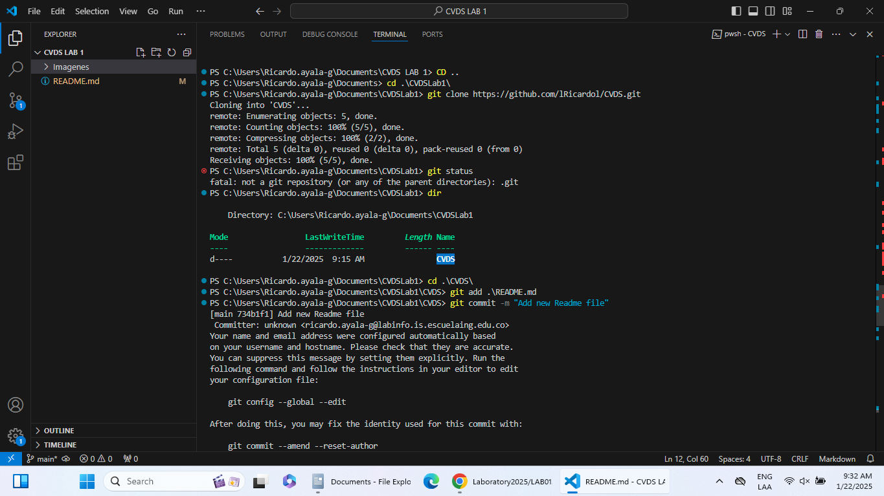

#Lab 1
# PARTE I (Trabajo Individual).
#1.Crea un repositorio localmente.
#2.Agrega un archivo de ejemplo al repositorio, el README.md puede ser una gran opción.
#3.Averigua para qué sirve y como se usan estos comandos git add y git commit -m “mensaje”
R. git add
sirve para prepara archivos para el siguiente commit.
git commit -m "mensaje"
sirve para: Guarda los cambios preparados con un mensaje que describe qué se hizo.
#4.Abre una cuenta de github, si ya la tienes, enlazala con el correo institucional.
#5Crea un repositorio en blanco (vacío) e GitHub.
#6Configura el repositorio local con el repositorio remoto.
